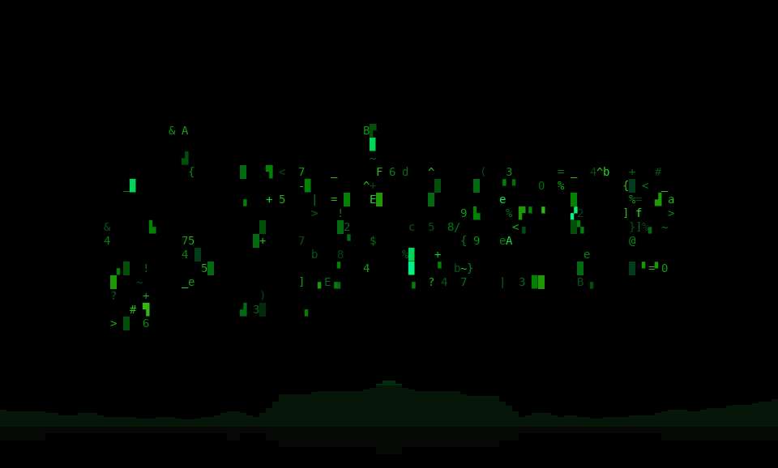

# glyphwave

A screensaver for Linux that runs in a fullscreen terminal. When you step
away it animates your distro's logo or your machine's name with text effects,
and while music plays it turns into a visualizer. When someone calls you on
Slack, Discord, Teams or WhatsApp, it shows who's calling. Touch a key or the
mouse and it's gone.



## Install

1. Download it. This puts one static binary in `~/.local/bin`, with no root
   and nothing compiled:

   ```sh
   curl -fsSL https://github.com/LuigiKraken/glyphwave/releases/latest/download/install.sh | sh
   ```

   Or build it yourself with `cargo build --release` (Rust 1.87 or newer).

2. Try it with `glyphwave`. This runs it in the current terminal, as a
   preview, until you press `q`. `glyphwave --test` plays a built-in demo
   track instead of your music and adds keys for every theme and a fake
   call.

3. Run `glyphwave setup`. It first asks for the banner: your distro's logo,
   your computer's name, or your own text. With more than one screen it
   then asks whether to run on all of them or just the main one. Then it asks in the order things
   happen: how long you're idle before it starts, how long it runs (or
   forever), whether coming back while it runs shows the lock screen, and
   what comes after the run (sleep, lock or screen off). Then whether it runs
   on battery, and whether the screen dims while it runs (by default only on
   battery). `b` goes back a question. Before it changes anything it sums up
   your answers in one line, such as "Idle for 5 min → glyphwave runs for 10 min → then it sleeps". Then it hooks itself
   into your desktop's own idle timer (KDE, GNOME, Hyprland, sway or X11). It
   lists every file it will change before it writes anything, and
   `glyphwave setup --remove` puts them all back. It never needs root and
   only writes to your home folder. To uninstall, run that and delete
   `~/.local/bin/glyphwave`.

To update, run the command from step 1 again. It replaces the binary and
leaves your settings alone. Run `glyphwave setup` again only if a release
says it added a question.

Videos and some players hold off the idle timer, so for music you can start
it yourself with Meta+Ctrl+L (next to Meta+L for lock) or from the app menu.

More than one screen: with `screens = all` (the default) it runs fullscreen
on every screen, and with `main` on the main one while the others go black.
Either way it's one process that records and analyses the music once, and a
key or the mouse on any screen ends it on all of them. Plugging a screen in
or out while it runs ends it too. This works on KDE (Wayland and X11), sway
and Hyprland, with any of the terminals below except GNOME Terminal. GNOME
and other X11 window managers don't let an app choose the screen a window
opens on, so there it runs on the screen the desktop picks and the others
stay as they are; setup says so.

Coming back to a locked screen: with `lock_after = 10` in the config, waking
the screensaver within its first 10 minutes takes you back to the desktop,
and after that to the lock screen. The screensaver keeps running until you
touch a key either way. `0` always locks, `none` (the default) never does.

Started with Meta+Ctrl+L or from the app menu, it's a music visualizer: waking
it never locks, whatever `lock_after` says, and the desktop doesn't dim, lock
or sleep while it runs. It keeps the screen on until you stop it, which costs
battery.

## What it does

With nothing playing, the banner goes through text effects in the style of
[terminaltexteffects](https://github.com/ChrisBuilds/terminaltexteffects): it
rains in, burns, decrypts, gets pulled into a black hole, holds for a while,
and leaves again.

When a player is playing (anything that speaks MPRIS: Spotify, browsers, most
Linux players), each cycle gets a music theme: `levels`, `pulse`, `shock`,
`wave`, `fire`, `matrix`, `glitch`, `springs`, `bounce` or `warp`. They
follow the kicks, snares and hi-hats. Themes change when the music does:
a quiet section fades into a calmer theme and a drop cuts straight to a busier
one. A stereo spectrum runs along the bottom in the banner's colours.

Two rules hold throughout: the banner stays readable, and nothing jumps.
Letters that moved go back home and effect layers fade out before the next
theme starts.

When someone calls you on Slack, Discord, Teams, WhatsApp, Zoom or Signal,
the screen shows the app's icon and who is calling. The music fades out and a
chime rings. Any key ends the screensaver so you can answer, and `c` ignores
the call and brings the music back. glyphwave reads the desktop's call
notification. It never answers or dismisses anything itself.

The banner is your distro's logo as fastfetch or neofetch draws it, your
hostname in big letters, your own words in the same letters, or any art you
put in `~/.config/glyphwave/banner.txt`. The GIF above uses a banner file.

## Keys

- **As the screensaver**, any key or the mouse ends it, except the music
  keys: `-` and `+` skip tracks and Enter pauses, without waking it.
- **Run by hand** (`glyphwave`): `q` quits, `v` skips to the next theme or
  effect, `i` switches between idle and music, `l` cycles the banner, and
  space, `n` and `p` control the player.
- **In `--test`**, also: `1`–`0` pick a theme, `d` `t` `s` `w` fake a
  Discord, Teams, Slack or WhatsApp call, and `[` `]` make the demo track
  calmer or louder.

`glyphwave --help` lists everything.

## What it needs

- A terminal. `glyphwave launch` looks for kitty, foot, Alacritty, Ghostty,
  WezTerm, Konsole, Ptyxis, GNOME Terminal or xterm.
- `parec` and `pactl` for the music (in `pulseaudio-utils`, `libpulse` on
  Arch), which desktops with PipeWire or PulseAudio normally have.
  `pw-record` works in place of `parec`.
- Optionally fastfetch or neofetch, for the logo banner.

## Cost

About 0.3 ms of CPU per frame at 160×45 and 30 fps. It only records audio
while a player reports that it's playing, and it waits for D-Bus signals
from the player instead of polling it.

## Status

It runs every day as the screensaver on the KDE laptop it was written for.
Two things are untested so far: GNOME and Fedora on a real install, and
real incoming calls from each app (they've only been tested with fake
notifications).

## How it works

It's written in Rust with four crates:
[realfft](https://crates.io/crates/realfft),
[zbus](https://crates.io/crates/zbus),
[signal-hook](https://crates.io/crates/signal-hook) and
[libc](https://crates.io/crates/libc). There's no TUI framework: it writes
the escape codes itself and only sends the cells that changed. Audio comes
from the monitor of the output the player plays to. Beats, onsets, drops
and section changes come from its own small DSP pipeline.
[docs/how-it-works.md](docs/how-it-works.md) covers the themes, the
analysis, the configuration and the references. Per-desktop setup details
are in [contrib/](contrib/).

## Similar projects

- [cava](https://github.com/karlstav/cava): the terminal audio visualizer
  with bars.
- [terminaltexteffects](https://github.com/ChrisBuilds/terminaltexteffects):
  text effects for anything you pipe into it.
- [bangen](https://github.com/programmersd21/bangen): animated ASCII banners,
  with export to GIF.
- [termtunes](https://github.com/fordpepper/termtunes): a now-playing
  dashboard with cover art and a spectrum.

glyphwave is a screensaver that combines the first two ideas on one screen.

## Credits

- [cava](https://github.com/karlstav/cava) by Karl Stavestrand: glyphwave's
  spectrum (several FFT sizes, log-spaced bars, auto-gain, gravity fall)
  follows its design. `docs/cava-tte-algorithms.md` describes cava's spectrum
  code in pseudocode derived from its source.
- [terminaltexteffects](https://github.com/ChrisBuilds/terminaltexteffects)
  by ChrisBuilds, and its Rust port [ttfx](https://github.com/omacom/ttfx) by
  37signals: the text effects, letters as particles on paths, and the easing
  curves come from them. Their default palettes, glyph sequences, katakana
  list and timing constants are used as they are.
- [toilet](http://caca.zoy.org/wiki/toilet) by Sam Hocevar: the big letters
  of the `name` banner are its bigmono12 font (WTFPL).

The code is glyphwave's own: the algorithms were re-implemented, not
translated or copied, and the data listed above is reused. [NOTICE](NOTICE) keeps their copyright notices and
[THIRD-PARTY-LICENSES](THIRD-PARTY-LICENSES) covers the crates.

## License

MIT OR Apache-2.0, at your option. See [LICENSE-MIT](LICENSE-MIT) and
[LICENSE-APACHE](LICENSE-APACHE).
